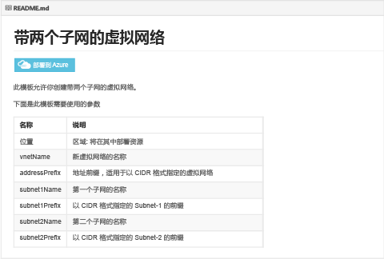
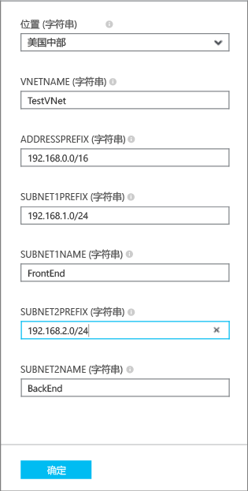
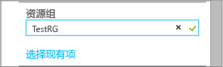

## 通过使用单击部署来部署 ARM 模板

你可以重用上载到由 Microsoft 维护并对社区开放的 github 存储库的预定义 ARM 模板。这些模板可直接从 github 部署，或者将其下载并修改以满足你的需要。若要部署用于创建包含两个子网的 VNet 的模板，请执行以下步骤。

1. 从浏览器导航到 [https://github.com/Azure/azure-quickstart-templates](https://github.com/Azure/azure-quickstart-templates)。
2. 向下滚动模板列表，并单击 **101-two-subnets**。选中 **README.md** 文件，如下所示。

	

3. 单击**“部署到 Azure”**。如有必要，输入你的 Azure 登录凭据。
4. 在**“参数”**边栏选项卡中，输入要用于创建新 VNet 的值，然后单击**“确定”**。下图显示了我们的方案的值。

	

4. 单击**“资源组”**并选择要将 VNet 添加到的资源组，或者单击**“新建”**将 VNet 添加到新资源组。若要了解有关资源组的详细信息，请参阅 。下图显示了名为 **TestRG** 的新资源组的资源组设置。

	

5. 如有必要，更改你的 VNet 的**“订阅”**和**“位置”**设置。
6. 如果你不想看到该 VNet 作为**启动板**中的磁贴，请禁用**“固定到启动板”**。
5. 单击**“法律条款”**，阅读条款，然后单击**“购买”**以表示同意。 
6. 单击“创建”以创建该 VNet。

	

7. 完成部署后，单击 **TestVNet** >**“所有设置”**>**“子网”**以查看子网属性，如下所示。

	

<!---HONumber=69-->