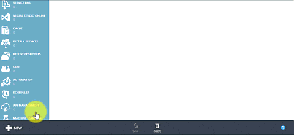

## 如何在 Azure 经典管理门户中创建 VNet

若要基于上述方案创建 VNet，请执行下面的步骤。

1. 从浏览器导航到 http://manage.windowsazure.cn，如有必要，请使用 Azure 帐户登录。
2. 单击**“新建”**>**“网络服务”**>**“虚拟网络”**>**“自定义创建”**，如下图所示。

	

3. 在**“虚拟网络详细信息”**页上，键入 VNet 的**名称**，选择其**位置**，然后单击页面右下角的箭头以转到步骤 2。下图显示了我们的方案设置。

	

4. 在**“DNS 服务器和 VPN 连接”**页上，为要使用的最多 9 个 DNS 服务器指定名称和 IP 地址。如果未指定 DNS 服务器，则你的 VNet 将使用 Azure 提供的内部名称解析解决方案。对于我们的方案，我们将不配置 DNS 服务器。
5. 如果要为你的 VNet 提供点到站点 VPN 访问，请启用**“配置点到站点 VPN”**复选框。如果未配置点到站点 VPN，在创建后随时可以将其添加到你的 VNet。对于我们的方案，我们将不配置点到站点 VPN。
6. 如果要在你的 VNet 与另一个 VNet 或本地网络之间提供站点到站点 VPN 连接，请启用**“配置站点到站点 VPN”**复选框，并指定是否要使用 **ExpressRoute**，以及要连接到的网络的名称。如果未配置站点到站点 VPN，在创建后随时可以将其添加到你的 VNet。对于我们的方案，我们将不配置站点到站点 VPN。
7. 单击页面右下角的箭头以转到步骤 3。下图显示了我们的方案设置。

	

8. 在**“虚拟网络地址空间”**页上的**“起始 IP”**下，单击 *10.0.0.0* 以更改 VNet 地址空间，然后键入要使用的起始地址空间。对于我们的方案，键入 *192.168.0.0*。
9. 在**“CIDR (地址计数)”**下选择子网掩码的位数。对于我们的方案，选择*“16 (65536)”*。
10. 在**“子网”**下，单击 *Subnet-1* 并在必要时重命名子网。对于我们的方案，将其命名为 *FrontEnd*。

	>[AZURE.NOTE]如果你单击了子网的名称文本框的外部，你将无法再编辑子网的名称。若要解决该问题，需要通过单击其右侧的 X 按钮来删除子网，然后按照下面的步骤 13 中所述添加新子网。

11. 在第一个子网的**“起始 IP”**下，指定该子网的起始 IP 地址。对于我们的方案，键入 *192.168.1.0*。
12. 在**“CIDR (地址计数)”**下选择第一个子网的子网掩码位数。对于我们的方案，选择*“24 (256)”*。
13. 如有必要，单击**“添加子网”**以添加新子网。对于我们的方案，请添加子网并重复执行步骤 10 至步骤 12 以配置 VNet，如下图所示。

	

14. 单击页面右下角的复选标记按钮以创建 VNet。几秒钟后，你的 VNet 将显示在可用 VNet 列表中，如下图所示。

	

<!---HONumber=69-->