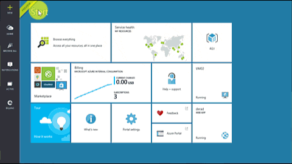

<!-- Ibiza portal: tested -->

## 如何在 Azure 门户预览中创建经典 VNet

若要基于上述方案创建经典 VNet，请执行以下步骤。

1. 从浏览器导航到 http://portal.azure.cn，如有必要，请使用 Azure 帐户登录。
2. 单击**“新建”**>**“网络”**>**“虚拟网络”**，请注意，**“选择部署模型”**列表已显示**“经典”**，然后单击**“创建”**，如下图所示。

	

3. 在**“虚拟网络”**边栏选项卡中，键入 VNet 的**名称**，然后单击**“地址空间”**。为 VNet 及其第一个子网配置地址空间设置，然后单击**“确定”**。下图显示了我们的方案的 CIDR 块设置。

	

4. 单击**“资源组”**并选择要将 VNet 添加到的资源组，或者单击**“新建资源组”**将 VNet 添加到新资源组。下图显示了名为 **TestRG** 的新资源组的资源组设置。有关资源组的详细信息，请访问 [Azure 资源管理器概述](/documentation/articles/resource-group-overview/#resource-groups)。

	

5. 如有必要，更改你的 VNet 的**“订阅”**和**“位置”**设置。

6. 如果你不想看到该 VNet 作为**启动板**中的磁贴，请禁用**“固定到启动板”**。

7. 单击**“创建”**，注意名为**“创建虚拟网络”**的磁贴，如下图中所示。

	

8. 等待创建 VNet，当看到下面的磁贴时，单击它以添加更多子网。

	

9. 你应当看到你的 VNet 的**配置**，如下所示。

	

10. 单击**“子网”**>**“添加”**，然后为你的子网键入**名称**并指定**“地址范围(CIDR 块)”**，然后单击**“确定”**。下图显示了当前方案的设置。

	

<!---HONumber=69-->