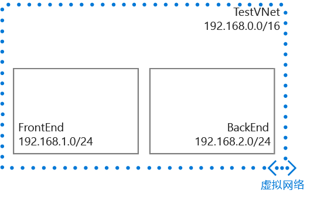

## 方案

为了更好地说明如何创建 VNet 和子网，本文档将使用以下方案。

在此方案中你将使用保留 CIDR 块 **192.168.0.0./16** 创建名为 **TestVNet** 的 VNet。你的 VNet 将包含以下子网：

- **FrontEnd**，使用 **192.168.1.0/24** 作为其 CIDR 块。
- **BackEnd**，使用 **192.168.2.0/24** 作为其 CIDR 块。

 

<!---HONumber=69-->