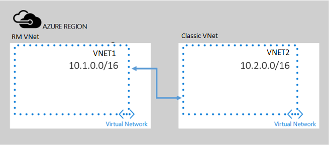

## 从 RM 部署模型到经典部署模型的对等虚拟网络

在此方案中，在名为 **VNET1** 和 **VNET2** 的两个 VNet 之间创建对等网络，这两个 VNet 分别属于 Azure Resource Manager 部署模型和经典部署模型。

> [AZURE.NOTE] 这两个虚拟网络必须位于同一订阅中。

  

<!---HONumber=Mooncake_1010_2016-->