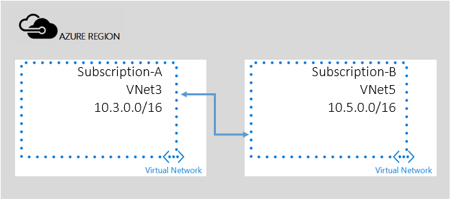

<!-- not suitable for Mooncake -->

## 跨订阅对等

在此方案中，将创建属于不同订阅的两个 VNet 间的对等互连。

VNet 对等互连依赖基于角色的访问控制 (RBAC) 进行授权。对于跨订阅方案，首先需要授予要创建对等互连链接的用户足够的权限；请注意：如果同一用户具有两个订阅的权限，则可跳过以下步骤 1-4。

<!---HONumber=Mooncake_0919_2016-->