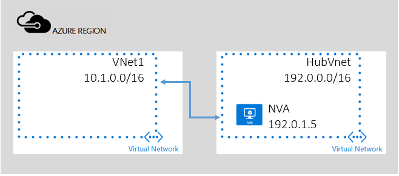

<!-- not suitable for Mooncake -->

## 服务链 - 通过对等 VNet 进行传输

尽管使用系统路由可以自动加快通信以方便部署，但在某些情况下，你需要通过虚拟设备来控制数据包的路由。
在此方案中，订阅中有两个 VNet - HubVNet 和 VNet1，其说明见下图。在 VNet HubVNet 中部署网络虚拟设备 (NVA)。在 HubVNet 和 VNet1 之间建立 VNet 对等互连后，可设置“用户定义路由”并指定 HubVNet 中到 NVA 的下一跃点。

注意：为了简单起见，假定此处的所有 Vnet 均属同一订阅。但也可用于跨订阅方案。

启用“传输”路由的关键属性是“允许转发的通信”参数。这将允许在对等 VNet 中接受进出 NVA 的流量。

<!---HONumber=Mooncake_0919_2016-->