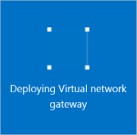

1. 在门户预览中，依次转到“新建”和“网络”。从列表中选择“虚拟网络网关”。

	

2. 在“创建虚拟网络网关”边栏选项卡的“名称”字段中，为网关命名。这与为网关子网命名不同。它是网关对象的名称。
 
3. 接下来，选择要部署到此网关的虚拟网络。单击箭头打开“选择虚拟网络”边栏选项卡，然后单击“VNet”。VNet 必须具有有效的网关子网才会显示在列表中。

4. 选择公共 IP 地址。单击箭头打开“选择公共 IP 地址”边栏选项卡。然后单击“新建”打开“创建公共 IP 地址”边栏选项卡。输入公共 IP 地址的名称。请注意，并不需要提供 IP 地址。IP 地址将动态分配。这是将向其分配地址的 IP 地址对象的名称。单击“确定”保存你的更改。

5. 对于“网关类型”，请选择针对配置指定的网关类型。

6. 对于“VPN 类型”，请选择针对配置指定的 VPN 类型。

7. 对于“订阅”，请确保选择正确的订阅。

8. 对于“资源组”，资源组取决于你选择的虚拟网络。

9. 对于“位置”，请确保显示的是资源组和 VNet 所在的位置。

10. 如果你希望网关显示在仪表板上，可以选择“固定到仪表板”。单击“创建”开始创建网关。你将在仪表板上看到“正在部署虚拟网络网关”磁贴。创建网关最多可能需要 45 分钟。有许多进程在后台运行。你可能需要刷新门户预览页才能看到完成状态。

	
	

11. 创建网关后，可以通过在门户预览中查看虚拟网络，来查看已分配给网关的 IP 地址。网关将显示为连接的设备。你可以单击连接的设备（你的虚拟网络网关）来查看详细信息。

<!---HONumber=Mooncake_0613_2016-->
