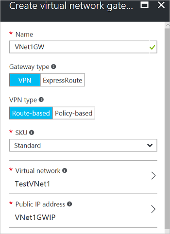
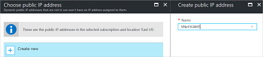
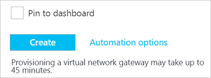

1. 在门户页左侧单击 **+**，然后在搜索框中键入“虚拟网关”。 在“结果”中找到并单击“虚拟网关”。 在“虚拟网关”边栏选项卡底部，单击“创建”。 这会打开“创建虚拟网络网关”边栏选项卡。
2. 在“创建虚拟网络网关”边栏选项卡中，填写虚拟网络网关的值。

    
3. **名称**：为网关命名。 这与为网关子网命名不同。 它是要创建的网关对象的名称。
4. **网关类型**：选择“VPN”。 VPN 网关使用虚拟网络网关类型“VPN”。 
5. **VPN 类型**：选择为配置指定的 VPN 类型。 大多数配置要求基于路由的 VPN 类型。
6. **SKU**：从下拉列表中选择网关 SKU。 下拉列表中列出的 SKU 取决于选择的 VPN 类型。
7. **位置**：可能需要滚动才能看到“位置”。 调整“位置”  字段，使其指向虚拟网络所在的位置。 如果该位置未指向虚拟网络所在的区域，该虚拟网络将不会显示在下一步的“选择虚拟网络”下拉列表中。
8. **虚拟网络**：选择要将此网关添加到其中的虚拟网络。 单击“虚拟网络”打开“选择虚拟网络”边栏选项卡。 选择 VNet。 如果看不到 VNet，请确保“位置”字段指向虚拟网络所在的区域。
9. **公共 IP 地址**：此边栏选项卡会创建一个公共 IP 地址对象，以便向其动态分配公共 IP 地址。 单击“公共 IP 地址”打开“选择公共 IP 地址”边栏选项卡。 单击“+新建”打开“创建公共 IP 地址”边栏选项卡。 输入公共 IP 地址的名称。 单击“确定”保存对此边栏选项卡所做的更改。

    
10. **订阅**：确保选择正确的订阅。
11. **资源组**：此设置取决于选择的虚拟网络。 
12. 指定上述设置后请不要调整“位置”  。
13. 验证设置。 如果希望网关显示在仪表板上，可以在边栏选项卡底部选择“固定到仪表板”  。
14. 单击“创建”  开始创建网关。 将会验证这些设置，并会在仪表板上看到“正在部署虚拟网络网关”磁贴。 创建网关最多可能需要 45 分钟。 你可能需要刷新门户页才能看到完成状态。

    
15. 创建网关后，即可在门户中查看虚拟网络，从而查看分配给网关的 IP 地址。 网关将显示为连接的设备。 可以单击连接的设备（虚拟网络网关），查看详细信息。