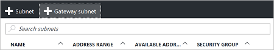
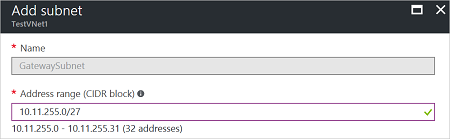

1. 在门户中，导航到要为其创建虚拟网关的虚拟网络。
2. 在 VNet 边栏选项卡的“设置”部分中，单击“子网”以展开“子网”边栏选项卡。
3. 在“子网”边栏选项卡中，单击顶部的“+网关子网”。 此操作将打开“添加子网”  边栏选项卡。 

    
4. 子网的“名称”  将自动填充为值“GatewaySubnet”。 Azure 需要此值才能识别作为网关子网的子网。 调整自动填充的**地址范围**值，使其匹配配置要求。

    
5. 单击边栏选项卡底部的“确定”以创建子网  。