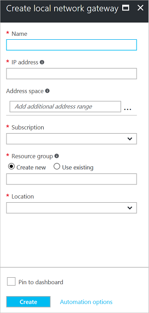

1. 在门户中，从“所有资源”单击“+添加”。 在“所有内容”边栏选项卡搜索框中键入“本地网关”，然后单击即可返回资源的列表。 单击“本地网络网关”打开边栏选项卡，然后单击“创建”打开“创建本地网络网关”边栏选项卡。

    

2. 在“创建本地网络网关”边栏选项卡中，指定本地网络网关对象的“名称”。 请尽可能使用直观的名称，例如 **ClassicVNetLocal** 或 **TestVNet1Local**。 这样即可更轻松地在门户中标识本地网关。
3. 为要连接的 VPN 设备或虚拟网络网关指定一个有效的公共 **IP 地址**。 **如果此本地网络代表本地位置：**请指定要连接的 VPN 设备的公共 IP 地址。 它不能位于 NAT 后面，并且必须可让 Azure 访问。 **如果此本地网络代表另一个 VNet：**请指定已分配给该 VNet 的虚拟网络网关的公共 IP 地址。 **如果还没有 IP 地址：**可以生成一个有效的占位符 IP 地址，然后在连接之前回来修改此设置。
4.  指的是此本地网络所代表的网络的地址范围。 可以添加多个地址空间范围。 请确保此处所指定的范围没有与连接到的其他网络的范围相重叠。
5. 对于“订阅” ，请确保显示的是正确的订阅。
6. 对于“资源组”，请选择要使用的资源组。 你可以创建新的资源组或选择已创建的资源组。
7. 对于“位置”，请选择将在其中创建此资源的位置。 可选择您的 VNet 所在的位置，但这不是必须的。
8. 单击“创建”  以创建本地网关。