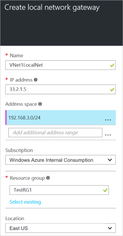

<!-- Ibiza portal: tested -->

1. 在 Azure 门户预览中，导航到“新建”>“网络”>“本地网关”。

	

2. 在“创建本地网关”边栏选项卡中，指定本地网关对象的“名称”。
 
3. 指定网关的“IP 地址”。这是要连接的外部 VPN 设备的 IP 地址。它不能位于 NAT 后面，并且必须可让 Azure 访问。

4. “地址空间”是局部（通常为本地）网络的地址范围。可以添加多个地址空间范围。此处输入的范围不能与任何通过网关通信的虚拟网络使用的地址空间范围重叠。你需要协调本地配置与 Azure 虚拟网络地址空间。
 
5. 对于“订阅”，请确保显示的是正确的订阅。

6. 对于“资源组”，请选择要使用的资源组。你可以创建新的资源组或选择已创建的资源组。若要创建新的资源组，请在框中键入名称。若要选择已创建的资源组，请单击“资源组”打开“资源组”边栏选项卡，然后选择要使用的资源组。

7. 对于“位置”，如果你要创建新的本地网关，可以使用相同的位置作为虚拟网络网关。但不一定要这样做。局域网网关可以位于不同的位置。

8. 如果想要轻松地从仪表板找到此局域网网关，请保留选中“固定到仪表板”。

9. 单击“创建”以创建本地网关。你将在仪表板上看到“正在部署局域网网关”。

10. 创建局域网网关后，它将在门户预览中打开供你查看。

	

<!---HONumber=Mooncake_0613_2016-->
