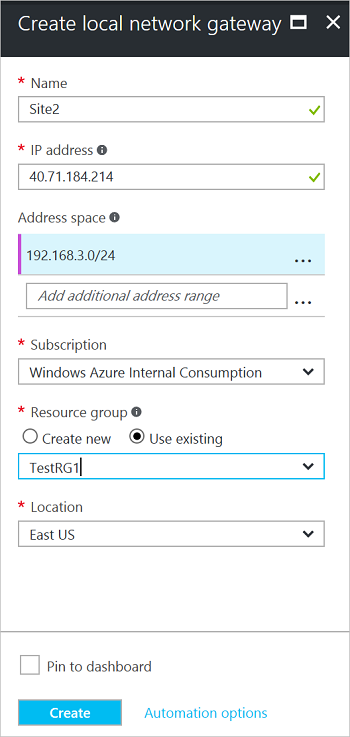

1. 在门户中，从“所有资源”单击“+添加”。 在“所有内容”边栏选项卡搜索框中键入“本地网络网关”，然后单击进行搜索。 这会返回一个列表。 单击“本地网络网关”打开边栏选项卡，然后单击“创建”打开“创建本地网络网关”边栏选项卡。

      
2. 在“创建本地网络网关”边栏选项卡中，指定本地网络网关对象的“名称”。
3. 为要连接的 VPN 设备或虚拟网络网关指定一个有效的公共 **IP 地址**。 这是要连接的 VPN 设备的公共 IP 地址。 它不能位于 NAT 后面，并且必须可让 Azure 访问。 请使用你自己的值，而不是屏幕截图中显示的值。
4.  指的是此本地网络所代表的网络的地址范围。 可以添加多个地址空间范围。 请确保此处所指定的范围没有与要连接到的其他网络的范围相重叠。 Azure 会将指定的地址范围路由到本地 VPN 设备 IP 地址。 请在此处使用你自己的值，而不是屏幕截图中显示的值。
5. 对于“订阅” ，请确保显示的是正确的订阅。
6. 对于“资源组”，请选择要使用的资源组。 你可以创建新的资源组或选择已创建的资源组。
7. 对于“位置” ，请选择将在其中创建此对象的位置。 可选择您的 VNet 所在的位置，但这不是必须的。
8. 单击“创建”  以创建本地网关。