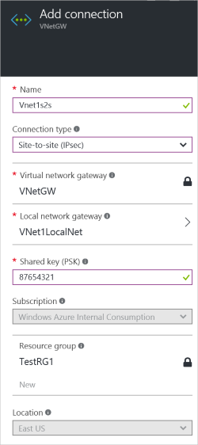
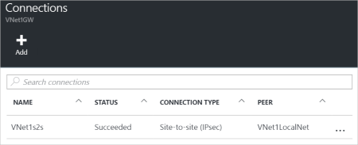

<!-- Ibiza portal: tested -->

1. 找到你的虚拟网络网关，然后然后单击“所有设置”打开“设置”边栏选项卡。

2. 在“设置”边栏选项卡上，单击“连接”，然后单击边栏选项卡顶部的“添加”打开“添加连接”边栏选项卡。

	

3. 在“添加连接”边栏选项卡中，输入连接的“名称”。

4. 对于“连接类型”，请选择“站点到站点(IPSec)”。

5. 对于“虚拟网络网关”，由于你要从此网关连接，因此值是固定的。

6. 对于“局域网网关”，请单击“选择局域网网关”并选择要使用的局域网网关。

7. 对于“共享密钥”，此处的值必须与用于本地 VPN 设备的值匹配。如果局域网上的 VPN 设备未提供共享密钥，你可以生成一个共享密钥，并在此处和本地设备上输入。重点是它们必须匹配。

8. 剩下的“订阅”、“资源组”和“位置”值是固定的。

9. 单击“确定”以创建连接。你将看到屏幕上闪烁“正在创建连接”。

10. 连接完成后，你将看到它出现在网关的“连接”边栏选项卡中。

	

<!---HONumber=Mooncake_0425_2016-->
