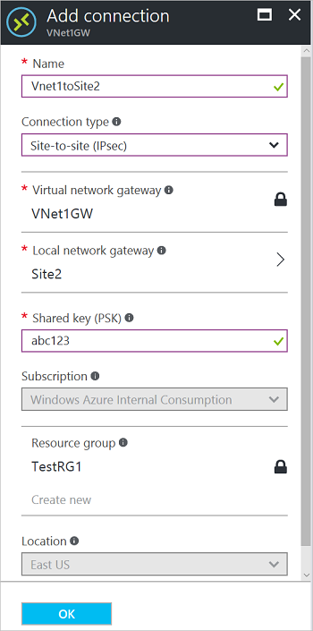
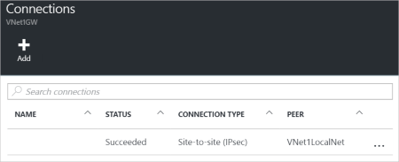

1. 定位虚拟网关。
2. 单击“连接”。 在“连接”边栏选项卡顶部，单击“+添加”打开“添加连接”边栏选项卡。

    
3. 在“添加连接”边栏选项卡中，输入连接的“名称”。 
4. 对于“连接类型”，请选择“站点到站点(IPSec)”。
5. 对于“虚拟网络网关”，由于你要从此网关连接，因此该值是固定的。
6. 对于“本地网络网关”，请单击“选择本地网络网关”并选择要使用的本地网络网关。 
7. 对于“共享密钥”，此处的值必须与用于本地 VPN 设备的值匹配。 在示例中，我们使用的是“abc123”，但你可以（而且应该）使用更复杂的。 重要的是，此处指定的值必须与配置 VPN 设备时指定的值相同。
8. 剩下的“订阅”、“资源组”和“位置”值是固定的。
9. 单击“确定”以创建连接。 你将看到屏幕上闪烁“正在创建连接”。
10. 连接完成后，将会显示在虚拟网关的“连接”边栏选项卡中。

    