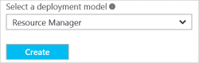

<!-- Ibiza Portal: tested -->

若要使用 Azure 门户预览创建 VNet，请遵循以下步骤。请注意，提供的屏幕截图用作示例。请务必替换为你自己的值。有关使用虚拟网络的详细信息，请参阅 [Virtual Network Overview](/documentation/articles/virtual-networks-overview/)（虚拟网络概述）。

1. 从浏览器导航到 [Azure 门户预览](https://portal.azure.cn)。如有必要，请使用 Azure 帐户登录。

2. 单击“新建”>“网络”>“虚拟网络”。

	

3. 从靠近“虚拟网络”边栏选项卡底部的“选择部署模型”列表中，选择“Resource Manager”，然后单击“创建”。

	

4. 在“创建虚拟网络”边栏选项卡上，配置 VNet 设置。在此边栏选项卡中，你将添加第一个地址空间和单个子网地址范围。完成创建 VNet 之后，可以返回并添加其他子网和地址空间。这是门户预览当前的一项限制。你随时可以通过在门户预览中编辑 VNet 属性或使用 PowerShell，来重新更新这些值。使用的值取决于要创建的配置。请务必参考计划的配置值。

	

5. 确认“订阅”正确无误。你可以使用下拉列表更改订阅。

6. 单击“资源组”并选择现有的资源组，或键入新的资源组名称以创建新的资源组。如果要创建新组，请根据计划的配置值来命名资源组。有关资源组的详细信息，请访问 [Azure 资源管理器概述](/documentation/articles/resource-group-overview/#resource-groups)。

7. 接下来，选择 VNet 的“位置”设置。请注意，该位置决定了你要部署到此 VNet 的资源所在的位置。以后，在不重新部署资源的情况下，将无法更改此位置。

8. 如果你希望能够在仪表板上轻松查找 VNet，请选择“固定到仪表板”，然后单击“创建”。
	
	

9. 单击“创建”后，你将看到仪表板上有一个磁贴反映了 VNet 的进度。创建 VNet 时，该磁贴将会更改。

	

<!---HONumber=Mooncake_0425_2016-->
