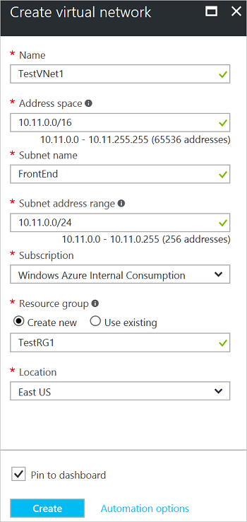

若要使用 Azure 门户在 Resource Manager 部署模型中创建 VNet，请执行以下步骤。 这些屏幕截图作为示例提供。 请务必替换为你自己的值。 有关使用虚拟网络的详细信息，请参阅 [虚拟网络概述](/documentation/articles/virtual-networks-overview/)。

1. 从浏览器导航到 [Azure 门户](http://portal.azure.cn) 并使用 Azure 帐户登录。
2. 单击“新建” 。 在“搜索应用商店”字段中，键入“虚拟网络”。 从返回的列表中找到“虚拟网络”，单击打开“虚拟网络”边栏选项卡。
3. 从靠近“虚拟网络”边栏选项卡底部的“选择部署模型”列表中，选择“Resource Manager”，然后单击“创建”。
4. 在“创建虚拟网络”  边栏选项卡上，配置 VNet 设置。 填写字段时，如果在字段中输入的字符有效，红色感叹号标记会变成绿色对钩标记。
5. “创建虚拟网络”边栏选项卡看起来与以下示例类似。 可能会有自动填充的值。 如果出现这种情况，将值替换为自己的值。

    
6. **名称**：输入虚拟网络的名称。
7. **地址空间**：输入地址空间。 如果有多个要添加的地址空间，请添加第一个地址空间。 可在创建 VNet 后再添加其他地址空间。 请确保指定的地址空间与本地位置的地址空间不重叠。
8. **子网名称**：添加子网名称和子网地址范围。 可在创建 VNet 后再添加其他子网。
9. **订阅**：确认列出的订阅是正确的。 可以使用下拉列表更改订阅。
10. **资源组**：选择现有的资源组，或键入新资源组的名称以创建新的资源组。 如果要创建新组，请根据计划的配置值来命名资源组。 有关资源组的详细信息，请访问 [Azure Resource Manager 概述](/documentation/articles/resource-group-overview/#resource-groups)。
11. **位置**：选择 VNet 的位置。 该位置确定要部署到此 VNet 的资源所在的位置。
12. 如果希望能够在仪表板上轻松查找 VNet，请选择“固定到仪表板”，然后单击“创建”。
13. 单击“创建”后，将看到仪表板上的磁贴反映了 VNet 的进度。 创建 VNet 时，该磁贴会更改。