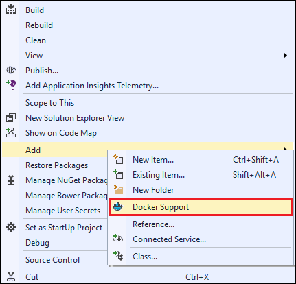
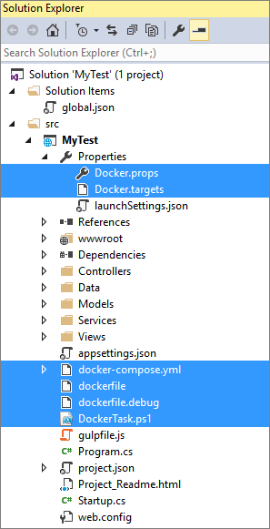

1. 在 Visual Studio 的“解决方案资源管理器”中右键单击项目，然后从上下文菜单中选择“添加”>“Docker 支持”。

      


1. 将 Docker 支持添加到 ASP.NET Core Web 项目会导致将多个 Docker 相关文件添加到该项目，其中包括 Docker-Compose 文件、Windows PowerShell 部署脚本和 Docker 属性文件。

      

    
> [AZURE.NOTE] 如果使用 [Docker for Windows Beta 版](https://beta.docker.com)，请打开 Properties\Docker.props，删除默认值并重新启动 Visaul Studio 使值生效。
> 
> ```
> <DockerMachineName Condition="'$(DockerMachineName)'=='' "></DockerMachineName>
> ```

<!---HONumber=Mooncake_1010_2016-->