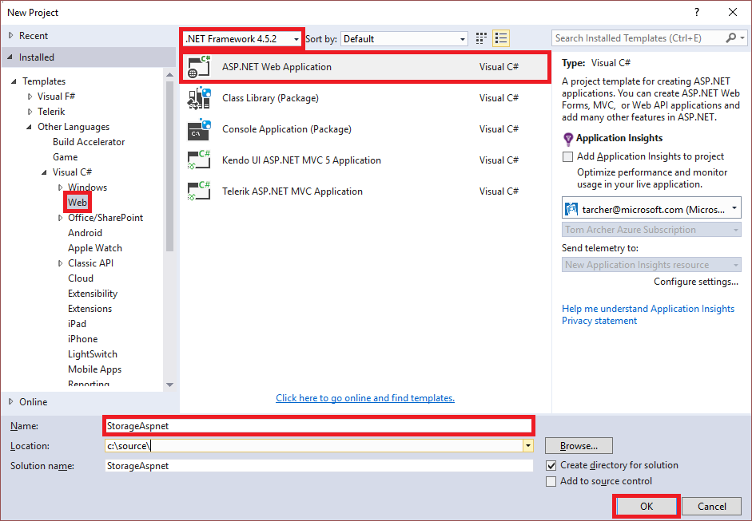
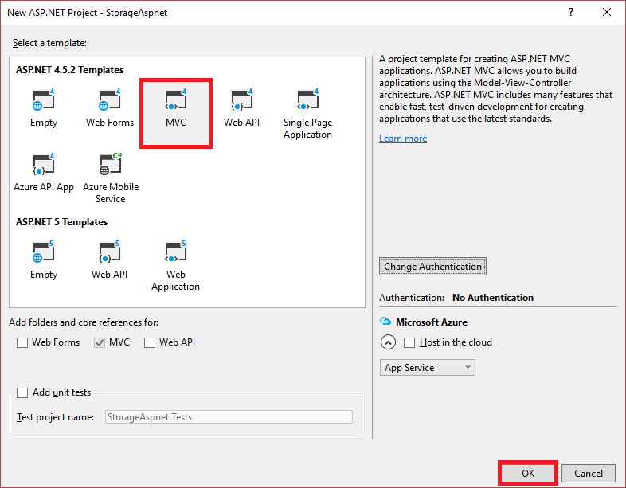
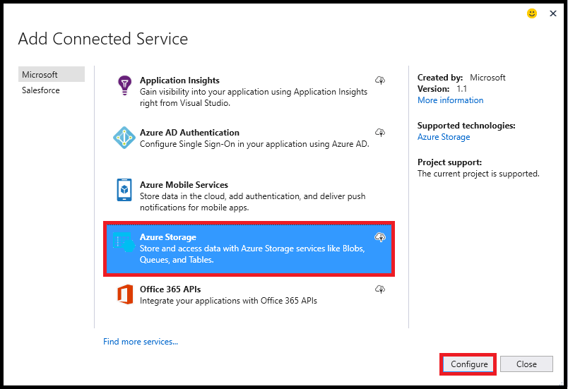

## 设置开发环境

本部分逐步讲解如何设置开发环境，包括创建 ASP.NET MVC 应用、添加“连接服务”连接、添加控制器，以及指定所需的命名空间指令。

### 创建 ASP.NET MVC 应用项目

1. 打开 Visual Studio。

1. 从主菜单中选择“文件”->“新建”->“项目”

1. 在“新建项目”对话框中，指定下图中突出显示的选项：

	  

1. 选择“确定”。

1. 在“新建 ASP.NET 项目”对话框中，指定下图中突出显示的选项：

	  

1. 选择“确定”。

### 使用“连接服务”连接到 Azure 存储帐户

1. 在“解决方案资源管理器”中右键单击该项目，然后从上下文菜单中选择“添加”->“连接服务”。

1. 在“添加连接服务”对话框中选择“Azure 存储”，然后选择“配置”。

	  

1. 在“Azure 存储”对话框中，选择想要使用的 Azure 存储帐户，然后选择“添加”。

<!---HONumber=Mooncake_1226_2016-->