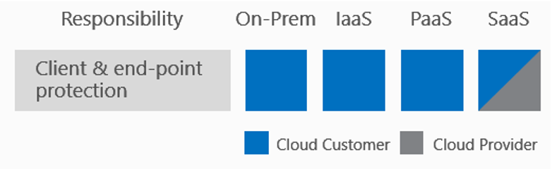
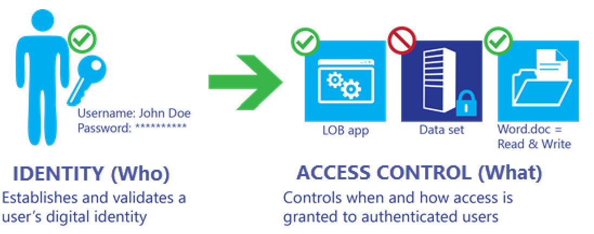
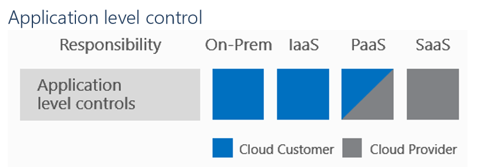
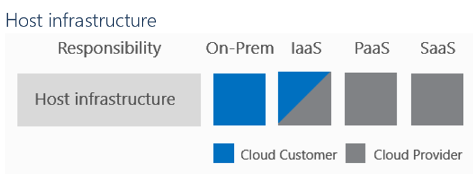
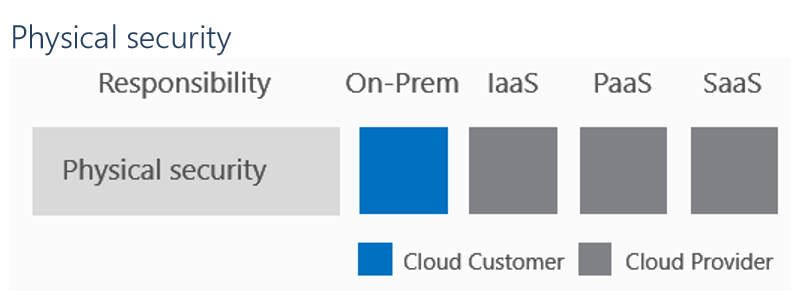

<properties
	pageTitle="Azure 紧急提示: 关于自查整改“翻墙”行为的通知！- Microsoft Azure"
    description=""
    services=""
    documentationCenter=""
    authors=""
    manager=""
    editor=""
    tags=""/>
	
<tags ms.service="announcement" ms.date="03/2016" wacn.date="03/2016" wacn.lang="cn"/>

# 云计算中的共担责任

## 免责声明

本文档仅供参考。我们对本文档的信息不做任何明示，暗示或者法律保证。

本文档所提供的“原样”信息和文档，包括 URL 和其他 Internet 网站的引用参考，可能会更改，恕不另行通知。您自行承担使用的风险。

本文档不会为您提供任何产品的任何知识产权的法律权利。您可以复制并使用该文档以供内部参考之用。

此处所描述的一些例子仅供说明并且属于虚构。没有真正的关联或联系，也不应推断。

注：本文件中的某些建议可能会导致数据增加，网络，或计算资源的使用，并可能增加您的许可证或订阅费用。

## 执行摘要

由世纪互联运营的 Microsoft Azure 提供的服务可以帮助客户满足安全、隐私和合规需求。本文有助于解释云解决方案提供商 ( CSPs ) 和他们的客户之间的关系，并说明他们的角色和责任。标准，如美国国家标准与技术研究院 ( NIST ) ( 特别出版物 500-292 ) 和 PCI 标准委员会 ( 补充信息：PCI DSS 云计算准则 ) 为共同的责任提供了仔细考虑。

此外，本文有助于解释一个组织选择云模式时需要考虑的共享角色和责任，比如软件即服务，平台即服务，基础结构即服务。本文还探讨了根据服务模式的选择需要考虑的合规性需求。

## 迁移到云端

当一个组织或机构在考虑和评估公有云服务时，有必要探索不同云服务模式将如何影响成本，易用性，私密性和安全性。同样重要的是客户应该考虑提供这个安全的计算解决方案的云解决方案提供商 ( CSP ) 是如何去管理私密性和安全性的。此外，许多组织对公有云计算都有一个误解，认为迁移到云端后他们在数据安全管理方面的角色职责完全转交给了云供应商。

云供应商自身应该为某些元素提供安全性，如物理基础设施和网络元素，但客户必须意识到自己的责任。云供应商可以提供服务帮助保护数据，但客户也必须了解他们在保护数据安全性和私密性方面所扮演的角色。这个问题最好的例证包括密码策略执行不力；用户如果不使用复杂或难以猜测的密码，云供应商的最佳安全性和私密性措施也将会失效。

### 云服务和交付模式

NIST 定义云计算作为一种服务交付模式，包括以下基本特征：

* 按需自助服务——用户可以自己提供所需服务
* 广泛的网络访问——可在任何媒介或设备，包括手机上使用服务
* 资源共用——多用户和共用资源的动态访问
* 快速的弹性——资源可以在使用或释放时迅速扩大或收缩
* 计量服务——基于所使用的服务收费

NIST 还定义了三种主要的云服务交付机制：基础设施即服务 ( IaaS )，平台即服务 ( PaaS ) 和软件即服务 ( SaaS )。

### 共担责任

我们了解不同的云服务模式是如何影响着云供应商和客户之间共担责任的方式。

在图 1 中，最左边的列表示七个应该被纳入考虑的责任 ( 在下面的部分中定义 )，所有这些都关乎计算环境的安全性和保密性。

数据分类和责任、客户端和终结点保护属于客户范畴的单一责任，而平台即服务 ( PaaS ) 和软件即服务 ( SaaS ) 模型中涉及到的物理架构、宿主机和网络属于云服务供应商方面的责任。

其余的责任由客户和云服务供应商共同承担。有些责任需要云服务供应商和客户共同管理，包括他们域的安全审核。例如，在使用 Azure 的 Active Directory 服务时要考虑身份和访问管理；服务配置的选择比如多因素身份验证是由客户来决定，但是确保有效的功能性是 Azure 的责任。

### 数据分类和责任

不管在本地还是云模式，用户都要负责保证其数据被安全地识别、标记和正确分类。区分敏感的客户数据和为公众设计的营销内容必须由客户来完成。数据分类是一个复杂的过程，但它是所有组织在考虑任何变化 ( 包括移动到云中 ) 时需要考虑的一个重要问题。

软件即服务解决方案如 Office 365 提供保护客户数据的功能，如 Office Lockbox 和 Data Loss Prevention，但最终必须由客户管理，分类和配置解决方案，以满足其独特的安全和隐私要求。

对于平台即服务的解决方案，客户对数据分类和管理的责任应当被认为是规划过程中必不可少的一部分。在这样的解决方案中，客户需要配置并建立流程来保护数据以及用于保护其数据的解决方案功能设置。Azure Rights Management 服务属于平台即服务，它为客户提供了数据保护功能，并已被集成到许多微软的软件即服务解决方案中。

在基础设施即服务模式中，客户数据以及已部署的任何支持解决方案都必须考虑责任和数据分类。错误配置的服务器会影响存储在服务中的数据受到保护。

### 客户端和终结点保护

由于采用更加多样化的设备，清晰界限的定义和用来连接到云服务的设备的职责界定也是至关重要的。云解决方案供应商可以提供管理终端设备的功能。但是，使用移动管理解决方案仍要求客户为他们自己的用户负责。

### 身份和访问管理

用户或身份管理是一个组织以无缝方式提供的核心服务之一，并且操作简单、易于管理。身份和访问管理给用户提供了在其环境中访问和使用资源的能力，这是图 5 所示的“谁 ( Who )”和“什么 ( What )”之间的纽带。

在平台即服务和软件即服务解决方案中，身份和访问管理是共担的责任，需要一个有效的实施计划，其中包括身份提供者的配置，管理服务的配置，用户身份的创建和配置，服务访问控制的实施。其他应考虑的注意事项包括多因素身份验证的使用，基于角色的访问控制，及时的管理控制，以及用户和控制点的监测和注册。

云计算解决方案如 Azure Active Directory ( Azure AD ) 提供诸如多因素身份验证，身份保护，强化基于角色的访问控制等功能。Azure AD 也具备提供本地和第三方应用程序的能力。云服务供应商可以提供可扩展单点登录功能来将客户和 CSP 之间的责任联系在一起，降低安全和隐私错误配置的风险。

基础设施即服务解决方案要求客户在托管的主机和虚拟机上配置以及管理身份和访问控制。Azure AD 等解决方案支持虚拟机的身份和访问控制，但必须在虚拟机级别进行配置。还必须注意在基础设施层服务运行时附加的安全性和合规责任。

### 应用级控制

平台管理的应用程序和服务，如 Azure Web Services , Batch , DocDb , IoT , Analytics , Media Services，以及许多相关功能，通过提供 Azure 管理的更安全的解决方案降低客户的责任。托管的应用程序要求客户正确配置服务，但同时也提供更全面的安全功能和集成其它解决方案，如身份管理。

云供应商和客户之间的共担责任可以用 Web 服务部署来说明。默认情况下，一个 Azure 的 Web 服务是可以被公开查看的，但这可能并不一定是期望状态，需要客户通过自行配置来达到设计时的需求。平台即服务的解决方案的好处之一是它们不像基础设施的部署 ( 如虚拟机 ) 一样要求相同的安全配置。这样的例子包括补丁管理，反恶意软件和基准配置。

在基础设施即服务模式中，客户有责任保护他们虚拟机上部署的操作系统和虚拟机应用层，使其免受攻击和损害。例如，如果一个基础设施即服务部署目标是建立一个 Web 服务产品，其管理员需要保障虚拟机和 Web 服务的安全性，这需要多个安全领域的专业知识。不管在 Windows 还是 Linux 中，虚拟机堆栈都需要熟练的管理员来管理和保护主机及其附件。

### 网络控制

网络控制包括配置，管理以及网络元素如虚拟网络、负载均衡、DNS 和网关的安全。这些控制为服务提供了交流和交互操作的方式。

在软件即服务解决方案中，网络控制作为软件核心产品的一部分，在提供给客户时经过了云供应商的管理和安全保障，因为云平台中的网络基础设施对客户来说是被抽象出来的。

如软件即服务解决方案，平台即服务中的大部分网络控制配置是由服务供应商完成的。在 Azure 中，混合解决方案是个例外，因为虚拟机被放置在 Azure 的虚拟网络中，它允许客户配置网络级服务。

在基础设施即服务解决方案中，客户和服务供应商共同负责网络解决方案的部署，管理，保护和配置。

### 主机基础设施

主机基础设施责任包括云计算的配置，管理和安全 ( 虚拟主机、容器、服务结构，自动缩放 )，存储 ( 对象、CDN、文件存储 ) 和平台服务。云供应商负责宿主服务 ( 例如服务的宿主操作系统 ) 的运维及安全。

基础设施即服务供应商和客户共同承担确保服务最优配置和安全的职责。此职责包括确保网络可以正确连通、设备能够连接或安装正确的存储设备所必需的权限和网络访问服务的配置

与网络控制一样，基础设施部署中的主机控制要求客户熟悉管理和保护虚拟机，包括网络管理，打补丁，操作系统配置，应用功能的部署，访问控制和身份管理配置。 基础设施即服务的解决方案需要用户在宿主机操作系统及支持服务栈方面具有很深的理解

### 物理安全

这些元素可以被认为是物理安全的组成部分，包括建筑或设施、服务器和网络设备。

客户认为迁移服务至云端最显著的价值就是物理环境的管理。云服务商，例如 Azure 数据中心，使用建筑物安全流程和策略来帮助确保基础设施免受未经授权的物理访问，这种能力以一种高度可用的方法被维护着，如果有灾难发生时，服务会被转移到一个新的物理地点来提供持续的服务。其他的物理安全考虑包括冷却，空气管理 ( 空气质量 )，设备管理和功率调节等功能。

### 结语
在共担责任模式下，安全的分层方法如下：

* 在**本地部署**时，客户对安全和操作解决方案的所有方面都负有责任。
* 对**基础设施即服务**来说，建筑、服务器、网络硬件和虚拟化这些元素需要由平台供应商管理。客户负有或共同承担对操作系统，网络配置，应用程序，身份，客户端和数据进行保护和管理的责任。
* 对建立在基础即服务部署上的**平台即服务**来说，供应商还要负责网络控制的管理和保护。客户仍然是负有或共同承担对应用程序，身份，客户端和数据进行保护和管理的责任。
* 对**软件即服务**来说，由对应的供应商提供应用程序，客户与底层组件之间被隔离开来。尽管如此，客户依然有责任确保数据正确分类，并共同承担管理他们自己用户和终端设备的职责。

对这种共担责任模式的理解的重要性是客户迁移至云端必不可少的前提。云供应商对安全性和合规工作提供了相当大的优势，但并没有免除客户保护他们的用户、应用程序和服务产品的责任。

